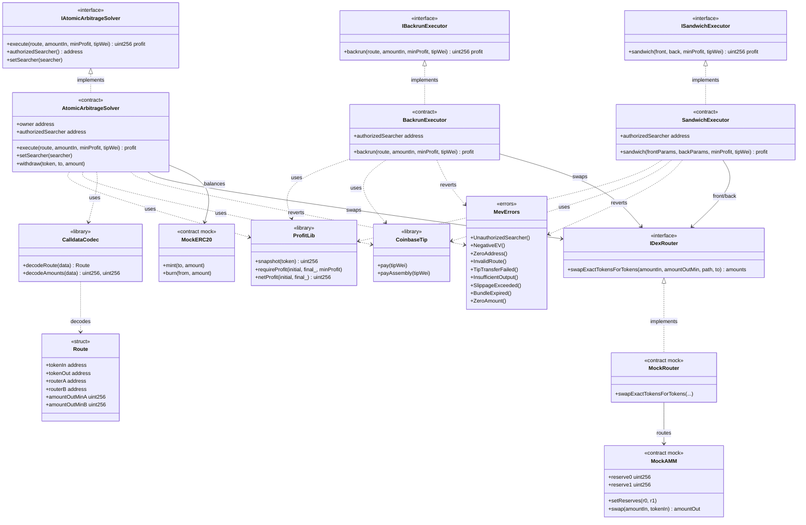

# Diagrama de clases — MEV & HFT Trading Infrastructure

Vista estructural de contratos, librerías e interfaces (módulo 15, **diseño v1**).

## Diagrama (Mermaid)

## Relaciones clave

| Relación | Motivo |
|----------|--------|
| Solver/Executors → `ProfitLib` | Snapshot y enforce de `minProfit` / `NegativeEV` |
| Solver/Executors → `CoinbaseTip` | Bribe al builder vía `block.coinbase` |
| Solver/Executors → `IDexRouter` | Swaps atómicos contra pools/routers |
| `CalldataCodec` → `Route` | Params compactos decodeados en Yul |
| Mocks AMM/Router | Simular imbalance sin mainnet |

## Decisiones de diseño (v1)

- Tres ejecutores separados (arb / backrun / sandwich) para aislar superficie de ataque y tests.
- Un solo `authorizedSearcher` por contrato (Ownable2Step puede rotarlo).
- Tip **dentro** de la misma tx atómica: si falla el profit check, revierte también el tip.
- Sandwich limitado a **lab/fork**; no se documenta runbook de explotación en mainnet.
- Bundles Flashbots viven off-chain (scripts Foundry); on-chain solo la ejecución tipada.
- Frontend Next.js: post-v1.
