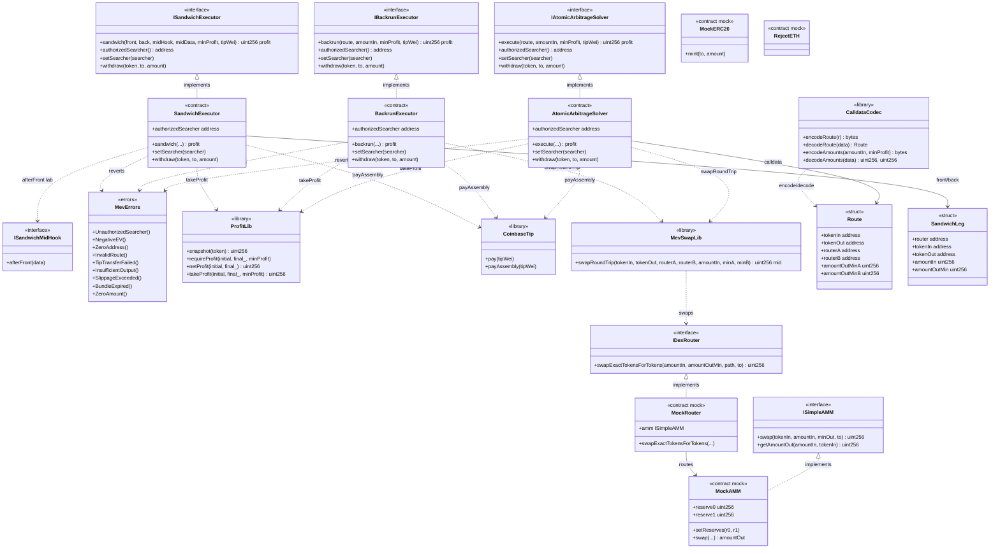

# Diagrama de clases — MEV & HFT Trading Infrastructure

Vista estructural de contratos, librerías e interfaces (módulo 15, **v1 implementado**).

## Diagrama (Mermaid)

## Relaciones clave

| Relación | Motivo |
|----------|--------|
| Solver/Backrun → `MevSwapLib` | Round-trip 2-router gas-optimizado |
| Solver/Executors → `ProfitLib.takeProfit` | Snapshot + `minProfit` en una pasada |
| Solver/Executors → `CoinbaseTip.payAssembly` | Tip Yul a `block.coinbase` |
| Sandwich → `ISandwichMidHook` | Victim simulada en lab (misma tx) |
| `CalldataCodec` → `Route` | Packed 144 B para builders off-chain |
| Mocks AMM/Router/`RejectETH` | Imbalance + tip fallido en tests |

## Decisiones de diseño (v1)

- Tres ejecutores separados (arb / backrun / sandwich) para aislar superficie y tests.
- `Ownable2Step` + `authorizedSearcher` por contrato.
- Tip **dentro** de la misma tx: si falla `takeProfit`, revierte también el tip.
- Sandwich **lab/fork only** vía midHook; no runbook de mainnet.
- Sin `forceApprove(0)` post-swap (tradeoff gas; routers trusted) — ver [`GAS.md`](./GAS.md).
- Bundles Flashbots off-chain (`SimulateBundle.s.sol`); on-chain solo ejecución.
- Frontend Next.js: post-v1.
