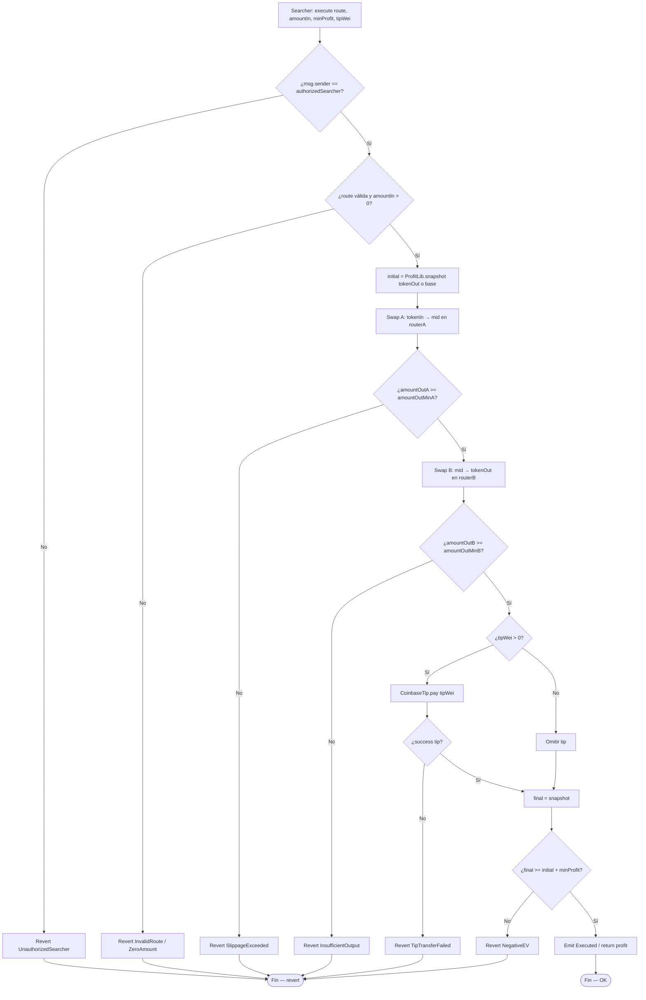
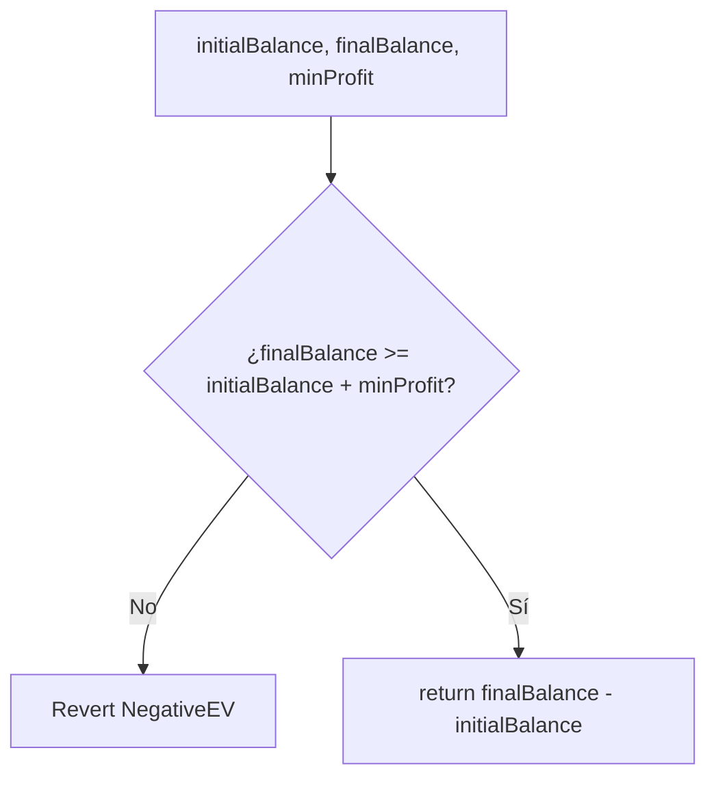
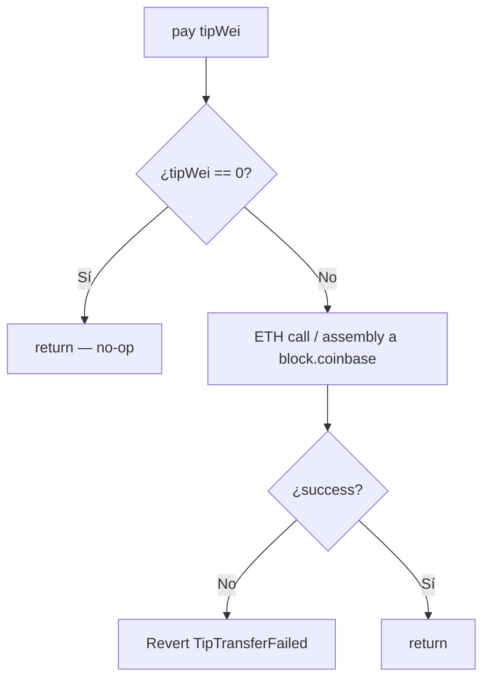
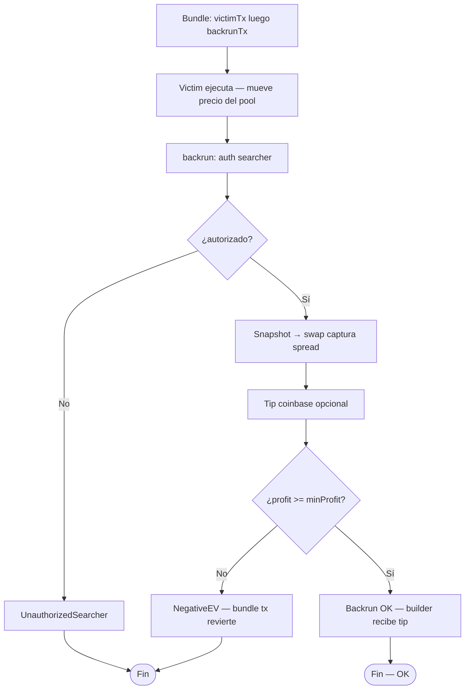
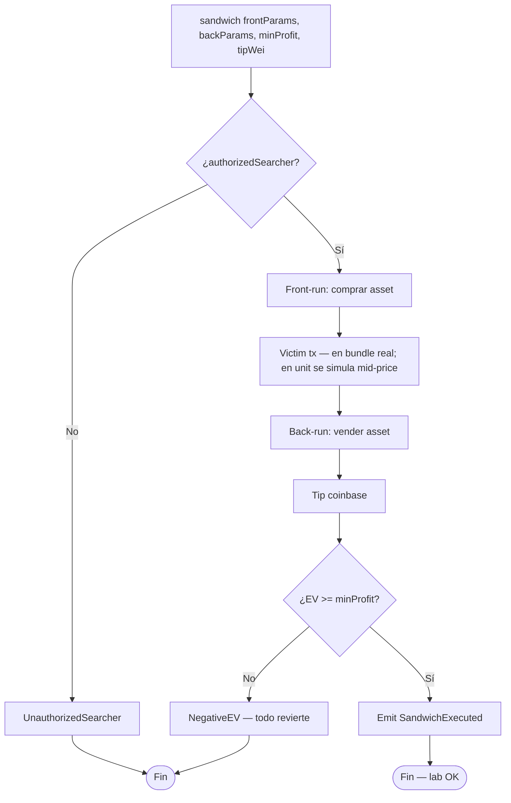
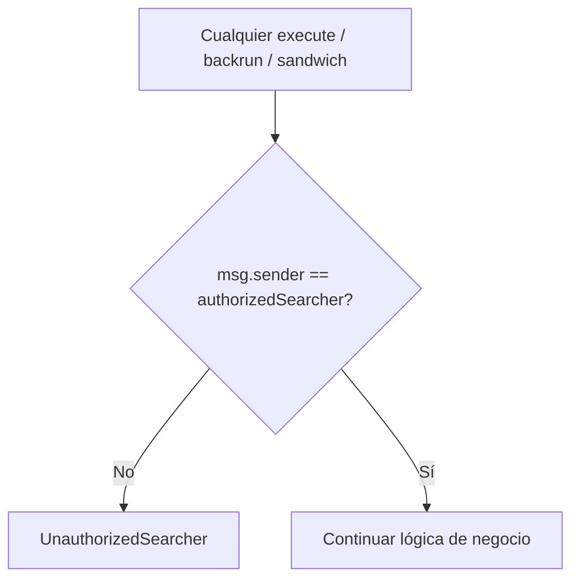
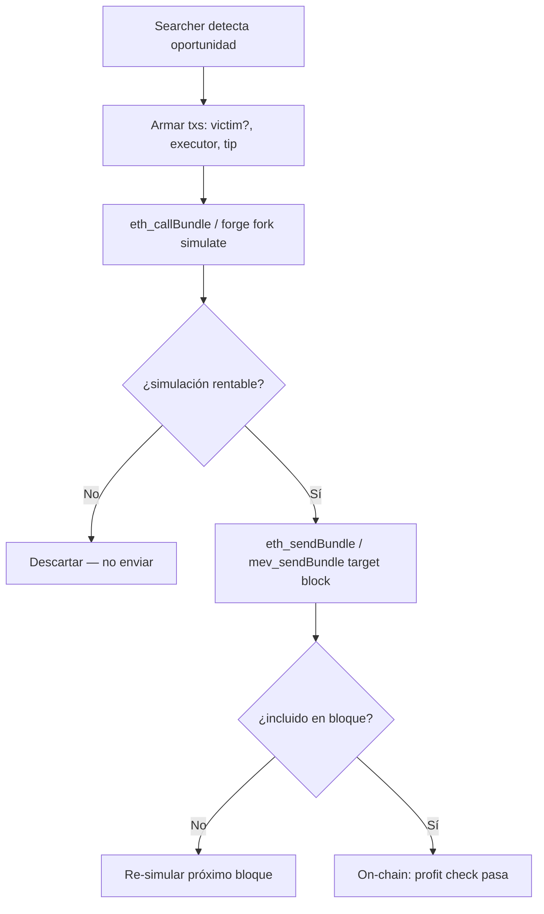
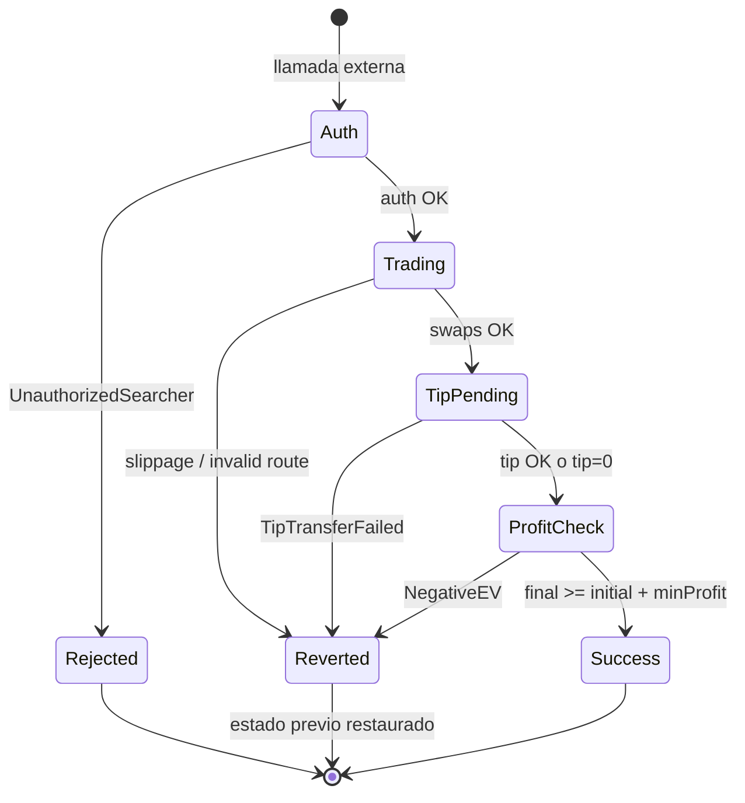
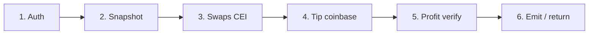

# Diagrama de flujo — Solvers MEV, tips y profit checks

Flujos de decisión internos de los ejecutores atómicos (módulo 15, **diseño v1**).

## 1. AtomicArbitrageSolver.execute

> Atomicidad: cualquier revert deshace swaps **y** tip (sin bribe residual).

## 2. Verificación de profit (ProfitLib)

## 3. CoinbaseTip — pago al builder

## 4. BackrunExecutor.backrun

## 5. SandwichExecutor.sandwich (lab)

## 6. Guard de acceso transversal

## 7. Simulación de bundle (off-chain / Foundry script)

## 8. Ciclo de estados — tx atómica del solver

## 9. Regla transversal — orden de efectos

