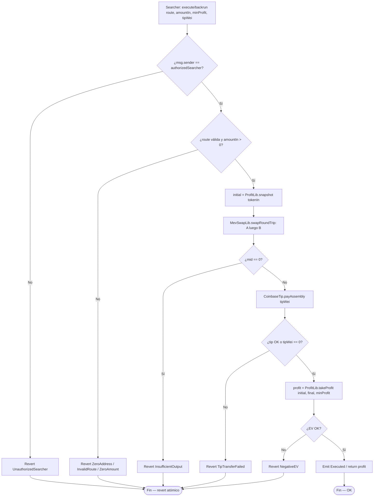
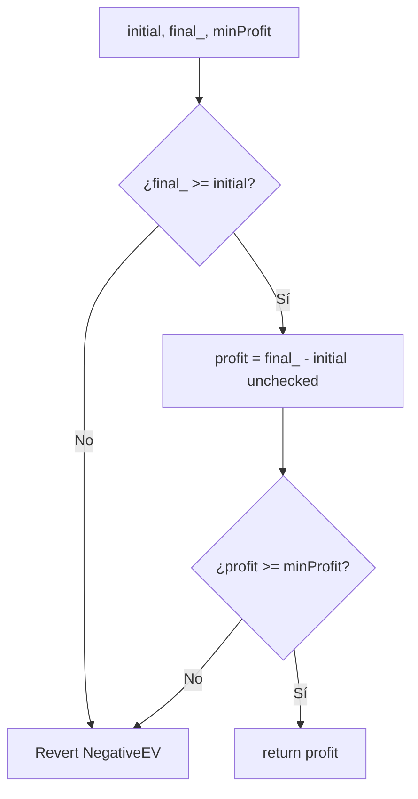
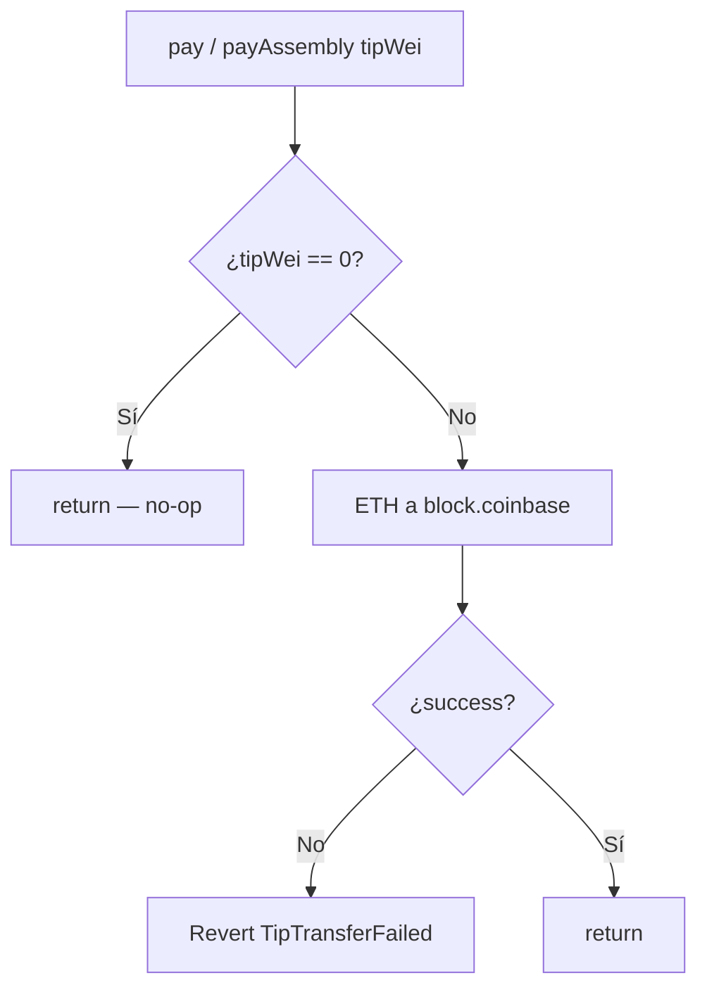
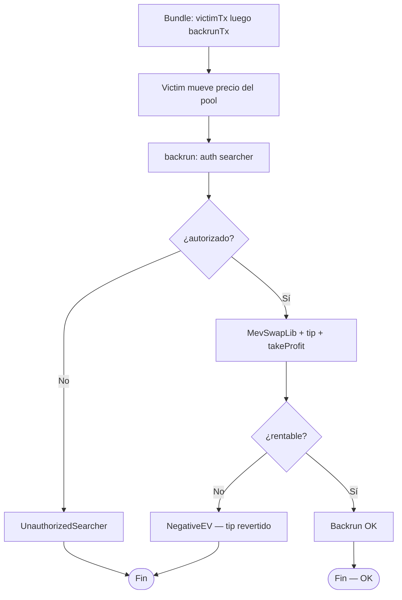
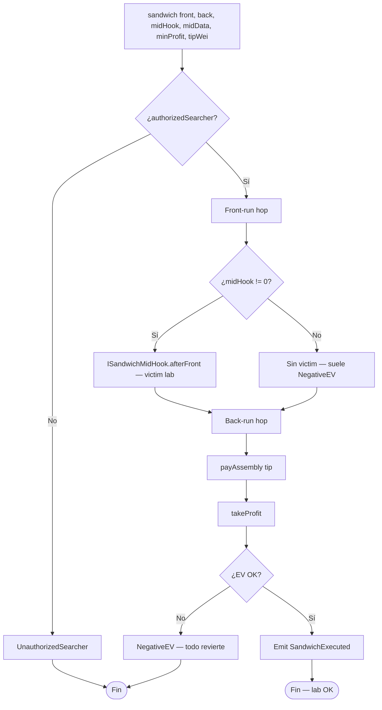
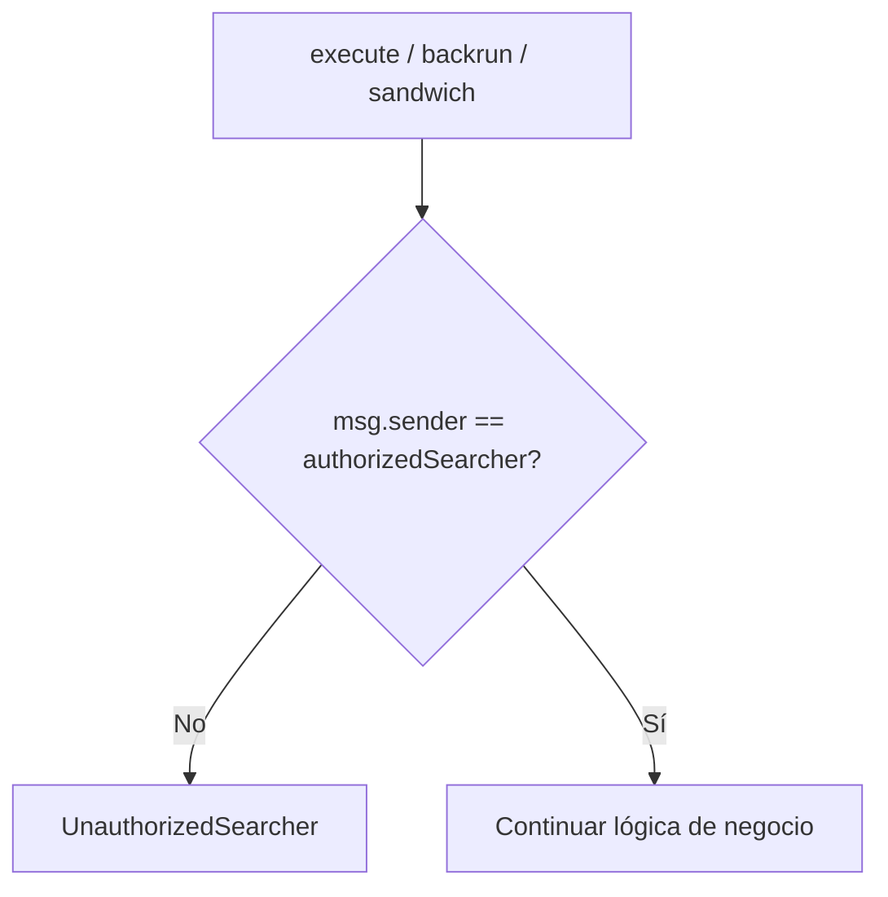
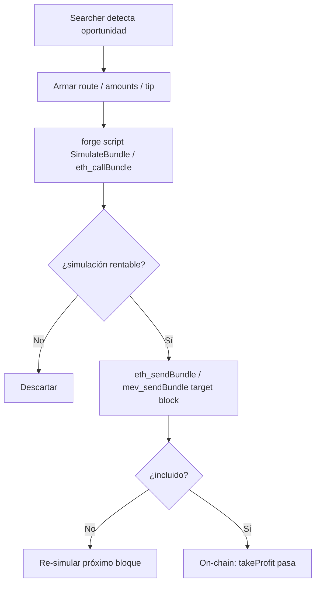
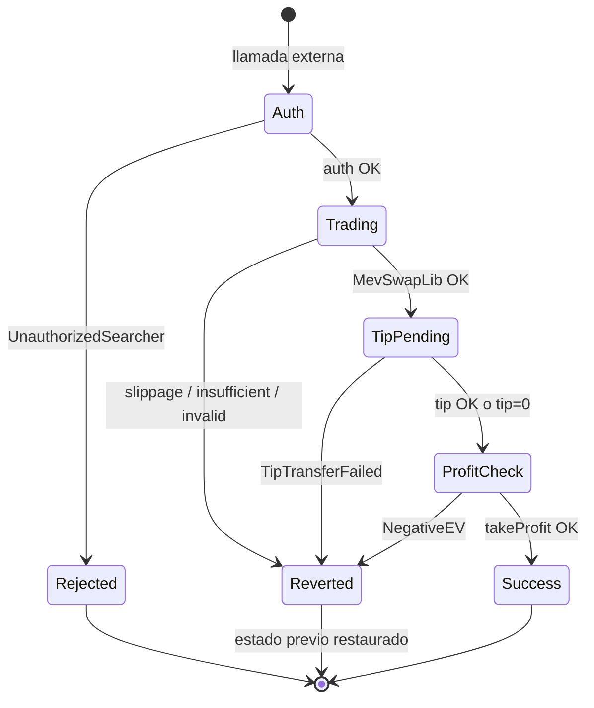
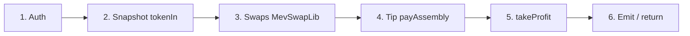

# Diagrama de flujo — Solvers MEV, tips y profit checks

Flujos de decisión internos de los ejecutores atómicos (módulo 15, **v1 implementado**).

## 1. AtomicArbitrageSolver.execute / BackrunExecutor.backrun

> Atomicidad: cualquier revert deshace swaps **y** tip (sin bribe residual).  
> Slippage de hop: lo aplica el router/AMM (`MockAMM.SlippageExceeded`).

## 2. ProfitLib.takeProfit

## 3. CoinbaseTip — pago al builder

> Producción: `payAssembly` (Yul). Tests comparan vs `pay` (`.call`) — ver [`GAS.md`](./GAS.md).

## 4. Backrun post-victim (bundle / test)

## 5. SandwichExecutor.sandwich (lab)

## 6. Guard de acceso transversal

## 7. Simulación de bundle (off-chain)

## 8. Ciclo de estados — tx atómica

## 9. Orden de efectos (hot path)

