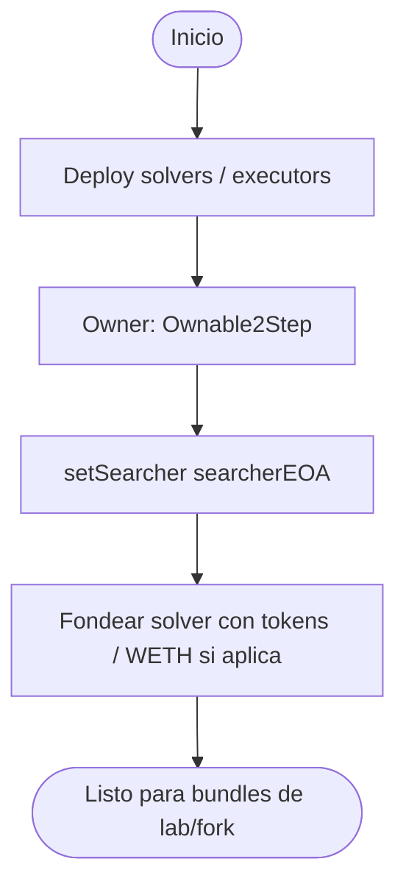
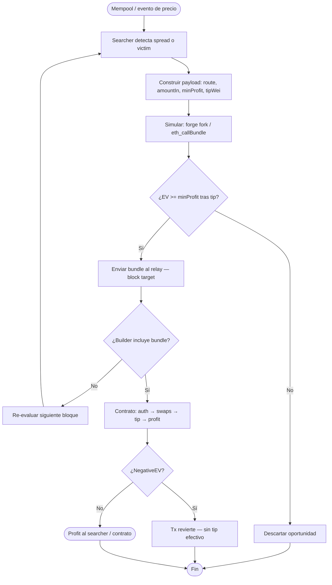
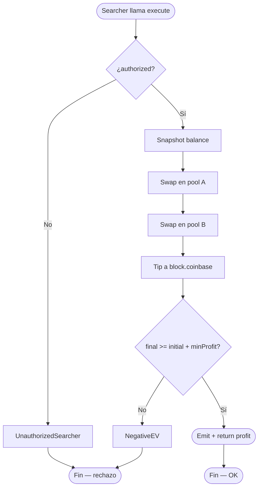
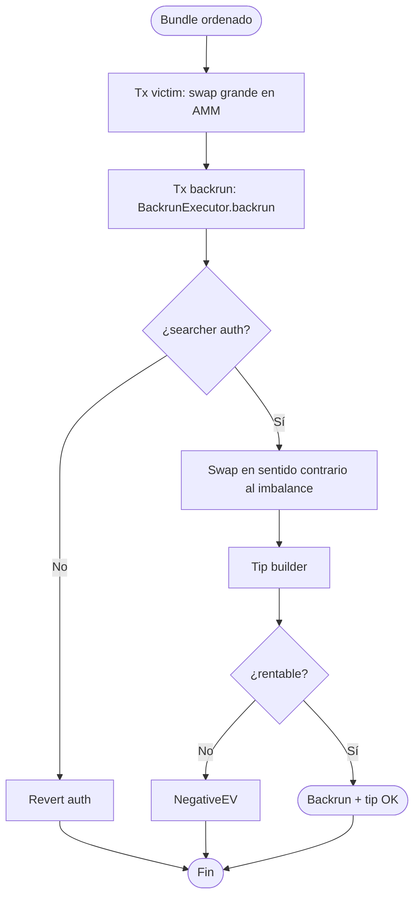
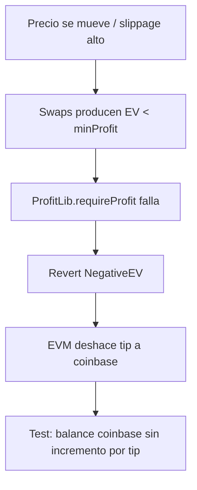
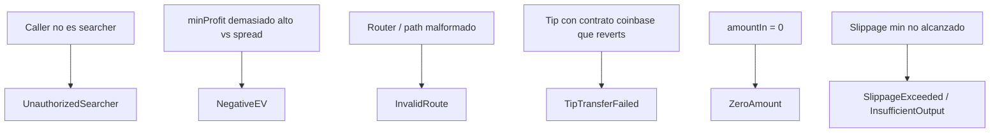
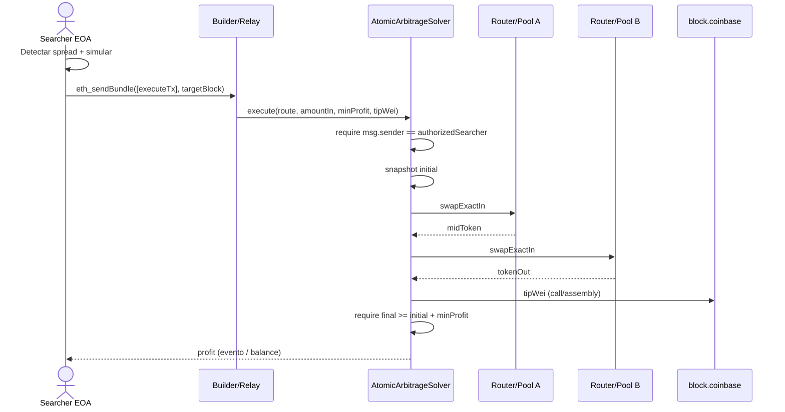
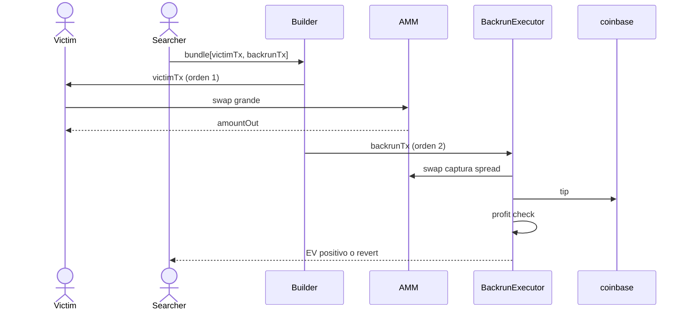
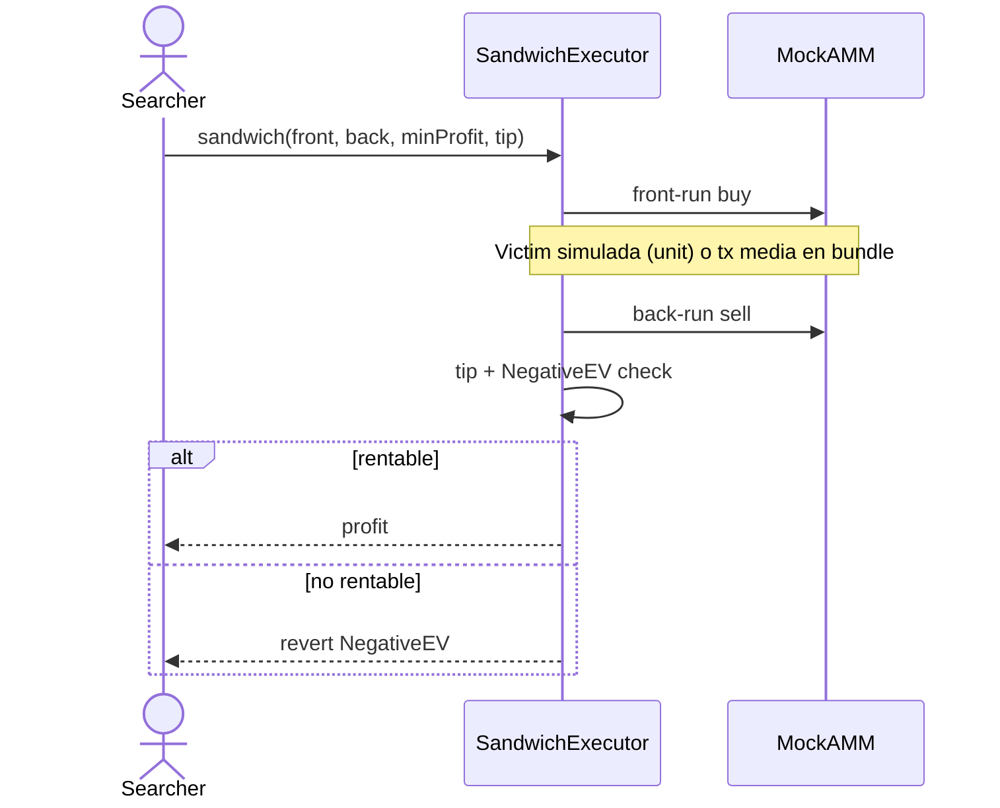
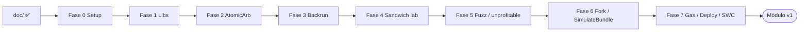

# Flujograma — Ciclo completo MEV & HFT Infrastructure

Flujo extremo a extremo entre actores, contratos y relayer/builder (módulo 15, **diseño v1**).

## Actores

| Actor | Rol |
|-------|-----|
| Searcher EOA | Detecta oportunidades; firma y envía txs del bundle |
| AtomicArbitrageSolver | Ejecuta arb 2-pool atómico + tip + profit check |
| BackrunExecutor | Captura spread post-victim |
| SandwichExecutor | Front+back en lab/fork |
| DEX / AMM | Pools donde ocurre el desequilibrio |
| Builder / Flashbots Relay | Recibe bundle privado; ordena txs; cobra tip vía coinbase |
| CI / Foundry | Unit, fuzz, fork, gas, simulate bundle |

---

## Flujograma principal — Deploy + autorización

---

## Flujograma principal — Searcher → bundle → on-chain

---

## Flujograma principal — Arbitraje atómico

---

## Flujograma principal — Backrun tras victim

---

## Flujograma — Revert-on-unprofitable (sin bribe)

---

## Flujograma — Ataques / misuse típicos

---

## Secuencia — camino feliz arbitraje + tip

---

## Secuencia — backrun en bundle

---

## Secuencia — sandwich lab (solo tests)

---

## Gobernanza de implementación

**Gate:** no avanzar de fase sin *“autorizo Fase N”*. Detalle en [`planificacion.md`](./planificacion.md).  
**Estado:** Fases **0–3** ✅. Fases **4–7** ⏳ pendientes de autorización.
