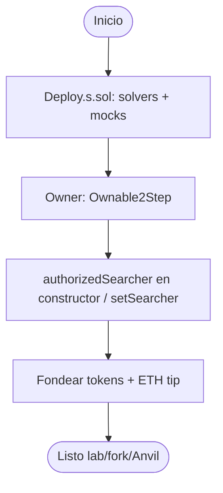
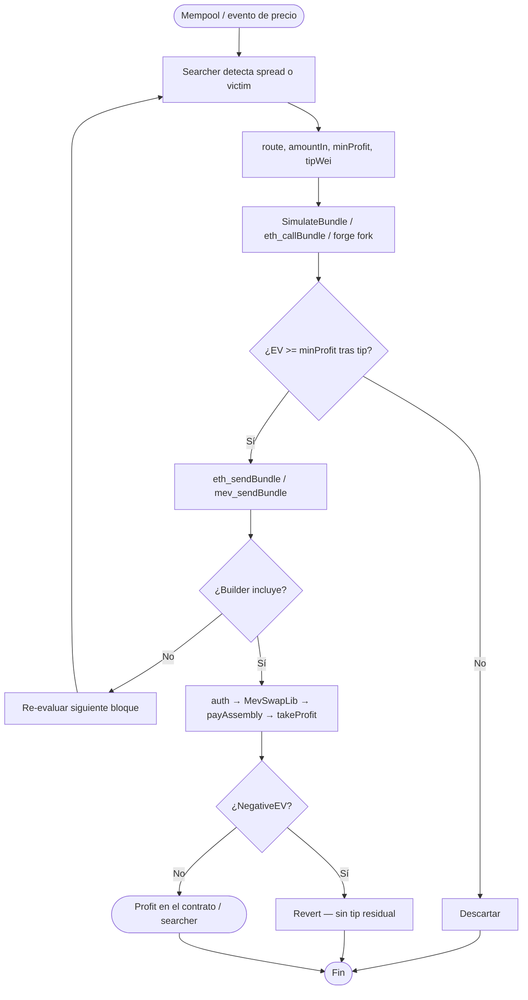
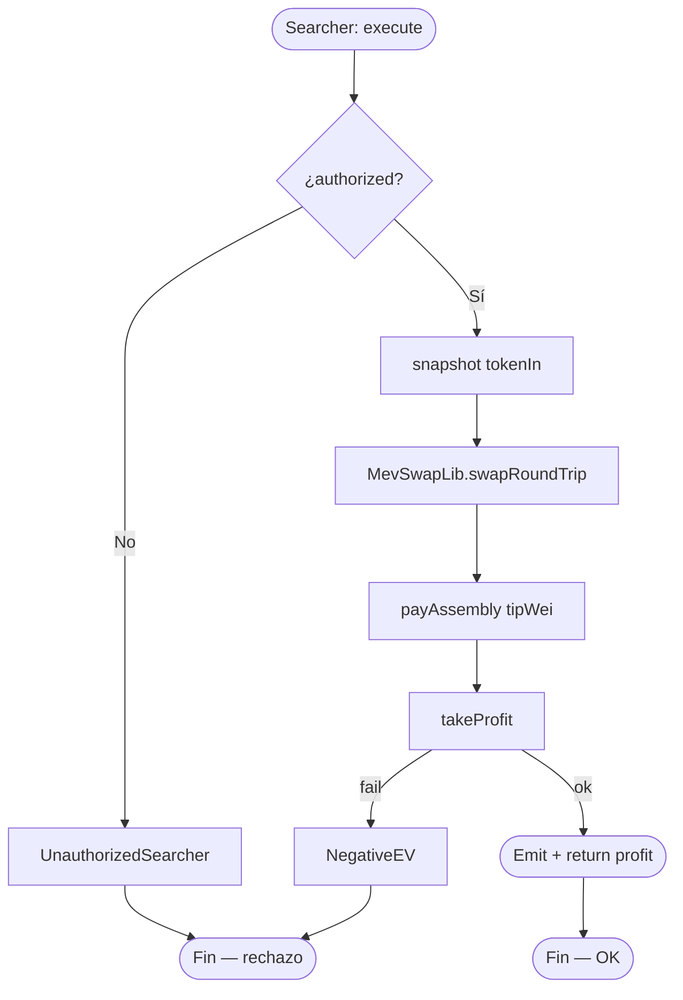
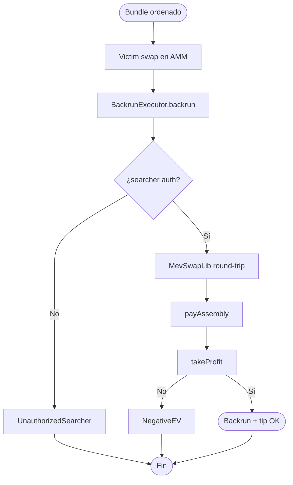
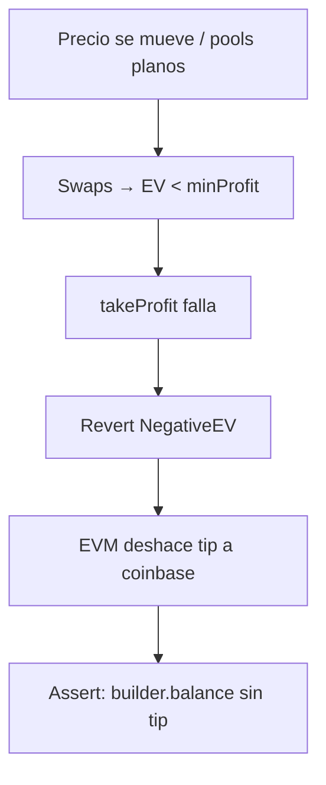
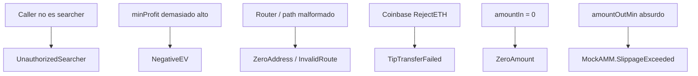
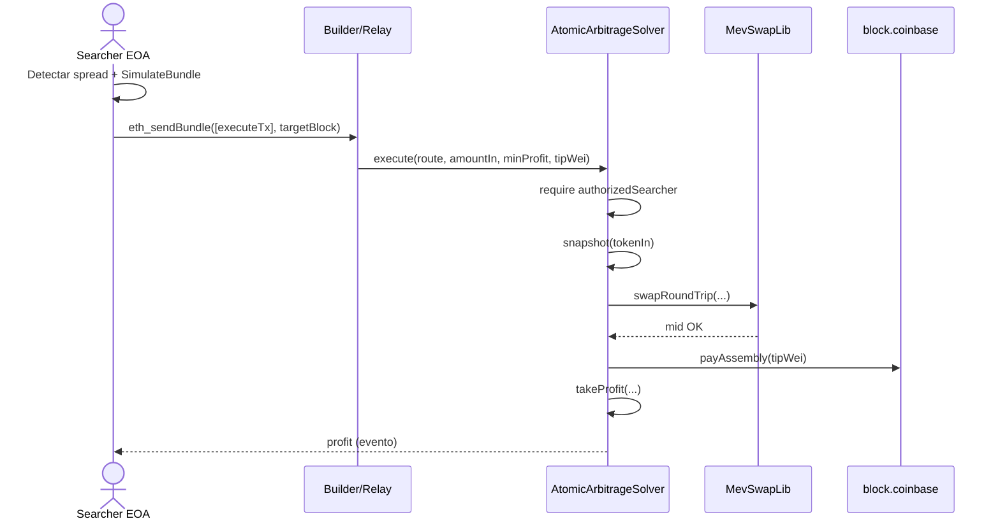
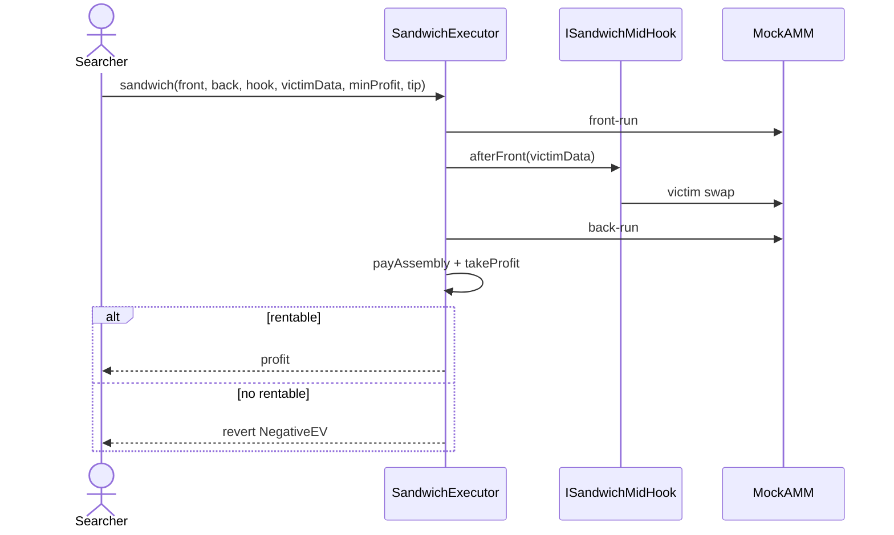
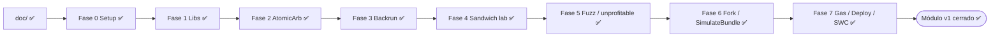

# Flujograma — Ciclo completo MEV & HFT Infrastructure

Flujo extremo a extremo entre actores, contratos y relayer/builder (módulo 15, **v1 implementado**).

## Actores

| Actor | Rol |
|-------|-----|
| Searcher EOA | Detecta oportunidades; firma y envía txs del bundle |
| AtomicArbitrageSolver | Arb 2-router + `MevSwapLib` + tip + `takeProfit` |
| BackrunExecutor | Captura spread post-victim (mismo hot path) |
| SandwichExecutor | Front → midHook victim → back (lab/fork) |
| MevSwapLib / ProfitLib / CoinbaseTip | Libs de swap, EV y tip |
| DEX / AMM (mocks) | Pools donde ocurre el desequilibrio |
| Builder / Flashbots Relay | Bundle privado; tip vía `block.coinbase` |
| CI / Foundry | Unit, fuzz, fork, gas, `SimulateBundle` |

---

## Flujograma principal — Deploy + autorización

---

## Flujograma principal — Searcher → bundle → on-chain

---

## Flujograma principal — Arbitraje atómico

---

## Flujograma principal — Backrun tras victim

---

## Flujograma — Revert-on-unprofitable (sin bribe)

---

## Flujograma — Ataques / misuse típicos

---

## Secuencia — camino feliz arbitraje + tip

---

## Secuencia — sandwich lab (midHook)

---

## Gobernanza de implementación

**Gate:** no avanzar de fase sin *“autorizo Fase N”*. Detalle en [`planificacion.md`](./planificacion.md).  
**Estado:** Fases **0–7** ✅ (módulo v1 cerrado).
